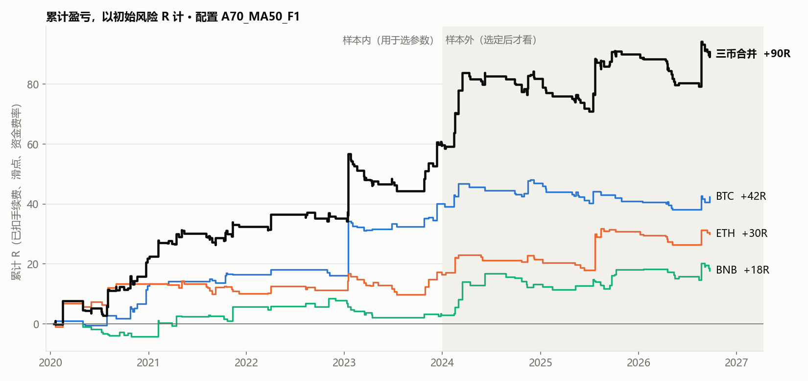
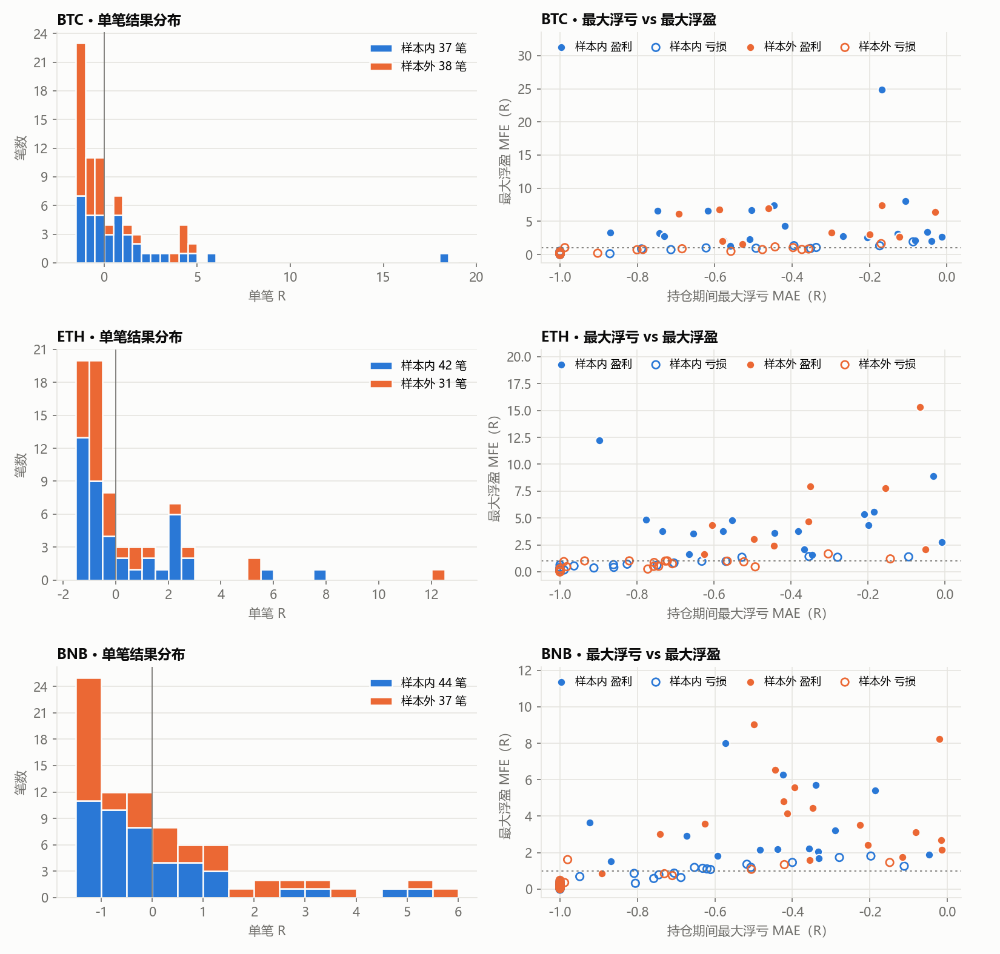
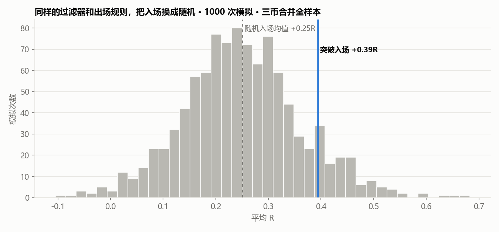

<div align="center">

# crypto-swing-backtest

**一套 4 小时趋势突破规则，在 BTC / ETH / BNB 永续合约七年历史上的检验记录**

*它想回答的不是"这套规则赚不赚钱"，而是"我手里的证据，够不够让我相信它"。*

</div>

---

## 结论

> **这套规则没有被证实有优势。**

- 在 BTC 上，按事先定好的标准挑出的最优配置，样本内平均每笔 **+1.08R**，样本外只剩 **+0.06R**。
- 三个币合并共 229 笔，七年里没有一年亏损，但 2024 年以来平均 R 的 95% 置信区间是 **[−0.32, +0.85]**，包含零。
- 全部利润来自最好的 10% 交易：这 23 笔合计 **+126.9R**，其余 206 笔合计 **−36.8R**。
- 把"突破"换成随机入场，其余规则不变，平均仍有 **+0.25R**（突破是 +0.39R），约一成的随机模拟不比突破差。

这是一份研究记录，不是可以直接照做的交易策略。



<sub>灰色区域是样本外。每条线是一个币单独交易的累计结果，黑线是三币合并。单位 R 的含义见下文。</sub>

---

## 目录

- [规则](#规则)
- [读懂 R](#读懂-r)
- [结果](#结果)
- [六个发现](#六个发现)
- [压力测试](#压力测试)
- [怎么防止自己骗自己](#怎么防止自己骗自己)
- [回测里最容易犯的错](#回测里最容易犯的错)
- [局限](#局限)
- [复现与测试](#复现与测试)
- [两个小工具](#两个小工具)
- [写给以后的自己](#写给以后的自己)

---

## 规则

只做多。一句话概括：**大趋势向上时，等价格创出新高再追进去，亏了认小亏，赚了让它跑。**

| 环节 | 规则 |
|---|---|
| 趋势过滤 | 日线收盘在 50 日均线上方，且 50 日均线本身在上升。只用已经收盘的日线。 |
| 入场 | 4h 收盘价高于此前 70 根 4h K 线的最高价，下一根开盘买入。 |
| 费率过滤 | 最近一次资金费率 ≥ 0.03% 时不开仓（多头过于拥挤）。 |
| 初始止损 | 入场价下方 2 倍 ATR。这段距离定义为 **1R**。 |
| 移动止损 | 持仓以来最高价下方 3 倍 ATR，只上移不下移。 |
| 时间止损 | 持仓满 30 根 K 线时检查一次，如果浮盈从未到过 +1R 就平仓。 |
| 仓位 | 同一时间每个币只持一笔。 |
| 成本 | 单边手续费 0.05%、滑点 0.02%，资金费率按真实历史在每次结算时扣。 |

这是最终选定的配置。实际测试了 24 组：突破长度 40 / 55 / 70 根，日线均线 50 / 100 / 200，费率过滤开或关，外加一种回调入场方式。

**这套规则出手很少。** 以 ETH 为例，近七年的 K 线一层层筛下来：


平均每年十笔左右，持仓时间合计不到总时间的 10%。

---

## 读懂 R

本仓库所有盈亏都用 **R** 表示，不用金额。

**1R = 这笔交易打到初始止损时亏掉的钱。** 一笔 +3R 的交易，赚到的是它本来愿意亏的三倍；一笔 −1R 的交易，就是正常止损。

这样做的好处是结果与账户大小、杠杆无关。想换算成金额，只需乘以你每笔愿意亏的数目。仓位大小由 `每笔风险 ÷ 止损距离` 决定，逐笔明细里的 `stop_pct` 列给出了止损距离占价格的比例。

**平均 R** 是核心指标：平均每做一笔，净赚多少倍的风险。大于零才谈得上有优势。

---

## 结果

配置 `A70_MA50_F1`，数据截至 2026-10-03。样本内是上线至 2023 年底，样本外是 2024 年起。

| 标的 | 区间 | 笔数 | 胜率 | 平均 R | 95% 区间 | 中位 R | 盈利因子 | 总 R | 最大回撤 | 最长连亏 |
|---|---|--:|--:|--:|:-:|--:|--:|--:|--:|--:|
| BTC | 样本内 | 37 | 54% | **+1.08** | [+0.21, +2.28] | +0.21 | 4.15 | +40.1 | 3.0R | 4 |
| BTC | 样本外 | 38 | 26% | **+0.06** | [−0.46, +0.66] | −0.74 | 1.10 | +2.2 | 9.9R | 6 |
| ETH | 样本内 | 42 | 38% | +0.39 | [−0.16, +1.03] | −0.68 | 1.76 | +16.5 | 6.9R | 5 |
| ETH | 样本外 | 31 | 29% | +0.44 | [−0.35, +1.49] | −0.59 | 1.85 | +13.5 | 5.4R | 7 |
| BNB | 样本内 | 44 | 34% | +0.07 | [−0.32, +0.53] | −0.38 | 1.15 | +3.0 | 6.4R | 7 |
| BNB | 样本外 | 37 | 46% | +0.40 | [−0.15, +1.03] | −0.27 | 1.84 | +14.8 | 5.3R | 5 |
| **三币合并** | 样本内 | 123 | 41% | +0.48 | [+0.19, +0.76] | −0.30 | 2.09 | +59.6 | 12.5R | 10 |
| **三币合并** | 样本外 | 106 | 34% | +0.29 | [−0.32, +0.85] | −0.56 | 1.54 | +30.5 | 13.4R | 12 |

单币样本全部少于 150 笔，属于**样本不足**。

**按入场年份：**

| 年份 | BTC | ETH | BNB | 合计 | 笔数 | 平均 R |
|---|--:|--:|--:|--:|--:|--:|
| 2020 | +12.7 | +13.3 | −4.2 | +21.9 | 30 | +0.73 |
| 2021 | +3.9 | −3.2 | +9.9 | +10.6 | 35 | +0.30 |
| 2022 | −0.4 | +1.2 | +2.1 | +2.9 | 15 | +0.19 |
| 2023 | +24.0 | +5.2 | −4.9 | +24.3 | 43 | +0.57 |
| 2024 | +6.9 | +5.0 | +10.3 | +22.2 | 36 | +0.62 |
| 2025 | −6.1 | +9.4 | +4.8 | +8.1 | 40 | +0.20 |
| 2026（至 10 月） | +1.4 | −0.9 | −0.3 | +0.2 | 30 | +0.01 |



---

## 六个发现

### 1. 样本内最好的那个，样本外最让人失望

BTC 上选出的配置是 24 组里平均 R 最高的（+1.08），样本外掉到 +0.06。

这不意外。从 24 个候选里挑最大值，挑中的往往是"真实水平加上好运气"的那个，运气不会跟到下一段。那 +1.08 里还有一笔 +18.1R 的交易，去掉它就只剩 +0.61。**样本内的最优数字，天然是高估的。**

### 2. 利润长在尾巴上

| | 笔数 | 合计 |
|---|--:|--:|
| 最好的 10% | 23 | **+126.9R** |
| 其余 90% | 206 | **−36.8R** |

中位数那笔交易是亏的。胜率不到四成。这套规则的日常体验是不断地小亏，然后等一年几次的大单把账填平。

这带来两个后果。一是**漏不起**：因为连亏而跳过一个信号、因为害怕而提前止盈，丢掉的可能正好是全年的利润。二是**测不准**：平均值由少数几笔决定，多一笔或少一笔大单，结论就会翻转。

### 3. 229 笔不等于 229 个样本

三个币高度相关。69% 的交易与另一个币的交易在时间上重叠，往往是同一波行情里三个币先后突破。

所以合并后的笔数虽然过了 150，独立信息量远没有那么多。这里的置信区间按**季度整块重抽样**计算，就是为了不把同一波行情重复算成三份证据。

### 4. 一年比一年弱

年均 R 从 2020 年的 +0.73，到 2025 年的 +0.20，再到 2026 年的 +0.01。可能是市场变了，可能只是噪音，目前的样本量分辨不出来。但这个方向不支持乐观。

### 5. 有两条规则几乎没在工作

- **时间止损**：24 组配置的样本内，每组最多只触发 1 次。走不出 +1R 的单子，绝大多数在 30 根之前就已经被止损打掉了。
- **费率过滤**：在 BTC 样本内，突破类配置的平均 R 全部提高（0.24 到 0.54）；在 ETH 上没有一致方向；在 BNB 上，9 组突破类配置有 8 组反而变差。而且 BTC 和 ETH 的费率在 2022、2025、2026 年从未达到过阈值，它在这些年份是一条不存在的规则。

一条只在一个币、一段时间里有效的过滤器，更像是对那段历史的拟合。

### 6. 换成随机入场，也能拿到一大半

这是最该停下来想的一条。保留日线趋势过滤、费率过滤、全部止损规则和交易频率，只把"收盘创 70 根新高"换成在符合条件的 K 线上**随机入场**，模拟 1000 次：



| 三币合并 | 突破入场 | 随机入场均值 | 随机入场的 5%–95% 范围 | 随机不差于突破的比例 |
|---|--:|--:|:-:|--:|
| 样本内 | +0.48 | +0.29 | [+0.05, +0.55] | 10% |
| 样本外 | +0.29 | +0.21 | [−0.05, +0.49] | 28% |
| 全部 | +0.39 | +0.25 | [+0.07, +0.45] | 10% |

随机入场平均也有 +0.25R。也就是说，这套规则的大部分收益来自"只在上升趋势里做多，亏了砍、赚了拿"，再加上这七年本身是牛市，而不是来自突破这个入场信号。突破比随机好一些，但好得不够多：十次随机里有一次能做到同样的成绩。

**所谓的优势，可能主要是行情给的。**

---

## 压力测试

以下检验只针对已选定的配置，不用于重新挑参数。完整表格见 [`out/robustness.md`](out/robustness.md)。

**成本再高一些，执行再慢一些**

| 情景（三币合并平均 R） | 样本内 | 样本外 | 全部 |
|---|--:|--:|--:|
| 基准：滑点 0.02%，下一根开盘成交 | +0.48 | +0.29 | +0.39 |
| 滑点 0.10% | +0.45 | +0.19 | +0.33 |
| 滑点 0.20% | +0.37 | +0.13 | +0.26 |
| 手续费翻倍 | +0.46 | +0.25 | +0.36 |
| 晚一根 K 线才成交 | +0.35 | +0.34 | +0.35 |
| 晚一根，且滑点 0.10% | +0.31 | +0.29 | +0.30 |

结果对成本和执行延迟不敏感，这是为数不多的好消息：它的问题不在于"利润薄到被成本吃掉"。

**把持仓途中的浮亏算进去，回撤更深**

| 最大回撤（R） | 只在平仓时记账 | 逐根按收盘价 | 含盘中最低价 |
|---|--:|--:|--:|
| BTC | 9.9 | 11.9 | 12.2 |
| ETH | 6.9 | 7.4 | 7.6 |
| BNB | 6.4 | 8.8 | 9.1 |
| 三币合并 | 13.4 | 17.2 | **18.1** |

结果表里的回撤是按平仓记账的，真实盯盘时看到的会深三成左右。

**每笔押多少，决定了回撤有多大概率超出承受范围**

固定比例下注，连续做 100 笔，按季度整块重抽样 5000 次。上半部分假设未来像全部历史，下半部分假设未来像 2024 年以来。

| 每笔风险占净值 | 回撤超 25% | 回撤超 50% | 期末净值中位数 | 期末净值 5% 分位 |
|---|--:|--:|--:|--:|
| *像全部历史* | | | | |
| 1% | 1% | 0% | 1.45× | 0.98× |
| 2% | 32% | 0% | 2.02× | 0.94× |
| 5% | 96% | 38% | 4.30× | 0.72× |
| 15% | 100% | 99% | 10.32× | 0.09× |
| *像 2024 年以来* | | | | |
| 1% | 13% | 0% | 1.30× | 0.81× |
| 2% | 67% | 6% | 1.62× | 0.64× |
| 5% | 99% | 71% | 2.56× | 0.29× |
| 15% | 100% | 100% | 2.29× | 0.01× |

中位数那一列很诱人，但要看的是右边那一列和中间两列。每笔押到 5%，几乎必然经历四分之一以上的回撤；押到 15%，腰斩基本是确定的事。而这一切的前提是历史分布会重复，这个前提本身没有被证实。

---

## 怎么防止自己骗自己

回测最大的敌人是研究者本人：试得够多，总能找到一组好看的参数。这里用三条约束来限制自己。

1. **数据切两段。** 2023 年底之前用来挑参数，之后的数据在挑完之前不看。
2. **挑选标准写在前面。** 只看 BTC 样本内，选平均 R 最高、且相邻突破长度在同一过滤条件下也为正的配置。这条规则写成了代码（`swing_backtest.select`），不靠人眼。
3. **只开一次盲盒。** 选定后只看这一个配置的样本外，无论结果如何都不换。

`run_all.py` 的执行顺序就是这个流程。

**需要坦白的一点：** ETH 用的是 BTC 上选出的同一配置，没有另选。BNB 则是在看过 BTC 和 ETH 的样本外结果**之后**才加入的，所以三币合并的"样本外"并不完全干净，可信度应当打折。

---

## 回测里最容易犯的错

这些错误的共同点是：代码能跑，结果好看，而且都是错的。

| 错误 | 后果 | 这里的处理 |
|---|---|---|
| 在 4h 数据上直接算 200 根均线当作日线均线 | 实际算的是 33 天均线，过滤器名不副实 | 先把 4h 合成日线，再算均线 |
| 用当天还没走完的日线做判断 | 偷看了未来 | 第 D 天的 K 线只使用第 D−1 天的日线结果 |
| 先用本根最高价抬高止损，再用本根最低价判断是否触发 | 假设了盘中先涨后跌，凭空多出利润 | 第 j 根的止损只用到第 j−1 根为止的数据 |
| 时间止损在第 30 根之后每根都检查当前浮盈 | 砍掉曾经大幅盈利、正在回调的趋势单 | 只在第 30 根检查一次，看的是历史最高浮盈 |
| 把资金费率向前填充到每根 4h 再累加 | 费率成本被算成两倍 | 只在真实结算时刻扣一次 |
| 费率列有空值就整行删掉 | 丢掉一半 K 线 | 空值保留，约 50% 的 K 线有结算值，程序启动时断言检查 |
| 直接按原始时间戳合并费率 | 静默丢失四成费率记录 | 见下文 |

**一个不容易发现的数据问题：** 币安接口返回的费率时间戳带有 1 到 47 毫秒的抖动（例如 `08:00:00.001`），超过四成的记录受影响。直接和 K 线时间戳做匹配，这些记录会悄悄对不上，不会报错，只是费率成本少了近一半。合并前必须先取整到小时。

`verify_is.py` 会不依赖回测引擎，把选定配置的每一笔样本内交易从头重算一遍：日线过滤、突破条件、止损路径、费率，逐项核对。

---

## 局限

- **样本不足。** 单币 31 到 44 笔一段，任何结论都撑不起来。
- **三个币不是三次独立实验。** 加币种增加的信息量有限。
- **只覆盖七年、一类资产。** 这段历史包含两轮大牛市，只做多的趋势规则天然占便宜。
- **成本是假设。** 滑点统一取 0.02%，极端行情下的真实滑点会大得多。
- **没有模拟强平和保证金。** 结果以 R 计，隐含假设每笔都能按计划的风险开出仓位。
- **没有做多重检验校正。** 24 组里挑最优带来的高估只做了定性说明，没有量化。
- **异常 K 线未清洗。** ETH 2020-03-13（最高 323，开盘 107）和 BTC 2021-07-26（最高 48168，开盘 35371）保留了原样。选定配置在这两根上没有持仓，但它们会影响 ATR 和前高。
- **规则里有我自己定的细节。** 见文末的实现约定，换一种合理的定法，数字会有出入。

---

## 复现与测试

```bash
pip install -r requirements.txt
python run_all.py
```

`run_all.py` 使用仓库里已有的数据，依次完成：数据检查、三个币的样本内网格、按规则选配置、逐笔复算、样本外、统计出图、压力测试、自动化测试。全程约一分钟。

`data/` 是冻结的研究快照。重新下载会改变样本外的数字：

```bash
python fetch_data.py
```

**测试**

```bash
python -m pytest
```

26 个测试分两类。`tests/test_engine.py` 用手工构造的 K 线逐条验证规则，上面那张"容易犯的错"表里的每一行都有对应的测试。`tests/test_data.py` 在真实数据上检查整条流水线：

- **截断测试**：把某个时间点之后的数据全部删掉，从头重算指标和交易，此前已平仓的每一笔必须分毫不差。只要代码任何地方偷看了未来，这个测试就会失败。
- 所有指标和信号列逐值比对，确认只依赖过去。
- 日线过滤逐日核对，包括"当天日线未走完"这个曾经出过错的边界。
- 资金费率每次结算只入账一次，合并前后的总和一致。
- README 里的关键数字被锁定，代码改动导致结果变化时会立刻发现。

| 文件 | 作用 |
|---|---|
| `swing_backtest.py` | 指标、回测引擎、统计、选择规则 |
| `fetch_data.py` | 从币安公开接口下载 4h K 线和资金费率 |
| `check_data.py` | 数据完整性检查 |
| `verify_is.py` | 独立重算样本内的每一笔交易 |
| `report.py` | 结果表、置信区间和两张主图 |
| `robustness.py` | 成本敏感性、逐根回撤、随机入场基准、仓位与回撤概率 |
| `run_all.py` | 按正确顺序跑完全流程 |
| `scan.py` | 查看各币当前状态 |
| `compare_live.py` | 实盘记录与回测逐笔对照 |
| `style.py` | 图表样式 |
| `tests/` | 自动化测试 |
| `data/` | K 线和资金费率 |
| `out/` | 各配置统计表、逐笔明细、图、压力测试报告 |

---

## 两个小工具

它们都不下单，也不保存任何账户信息。

**`scan.py`：现在各个币处于什么状态**

```bash
python scan.py --refresh
```

下载最新数据到 `data/live/`（不动研究快照），然后对每个币给出：规则当前是否持仓、下一根 K 线的止损价、是否刚出信号、距离触发突破还差多少。加上 `--risk 20 --equity 1000` 这样的参数，会按"止损时亏 20"换算出开仓数量和名义价值。

```text
ETHUSDT   最后一根已收盘 K 线：2026-10-03 08:00 UTC，收盘价 2683.19
  状态：空仓
  日线趋势过滤：通过
  最近一次资金费率：0.0001%（低于阈值 0.03%）
  下一根要触发突破，收盘需高于 2806.76（距现价 +4.61%）
```

**`compare_live.py`：我执行得怎么样**

```bash
python compare_live.py live_trades.csv
```

把实盘成交记录和回测逐笔对照，回答三个问题：真实成交价比回测假设差多少，哪些信号漏了，哪些单子背后根本没有信号。记录格式见 `live_trades_example.csv`（示例数据是虚构的）。

```text
实盘 6 笔：匹配到信号 5 笔，无对应信号 1 笔；规则在此期间另有 1 笔你没有做
入场滑点 平均 +0.052%，出场滑点 平均 +0.092%（回测假设单边 0.02%；正数表示比参考价更差）
单笔结果 实盘平均 -0.58R，回测平均 -0.55R，差 -0.03R
```

小样本实盘的意义就在这里：它测不出规则好坏，但测得出执行偏差。

<details>
<summary><b>实现约定</b>（规则文字没有写明、由代码决定的部分）</summary>

<br/>

- ATR 用 Wilder 平滑，周期 14；EMA50 基于 4h 收盘价。
- "均线向上"指日线 MA50 高于前一日的 MA50。
- 入场成交价 = 下一根开盘价 ×（1 + 滑点），1R 从成交价起算。
- 初始止损在入场当根就生效。
- 开盘就跳空到止损下方时，按开盘价成交。
- 入场那一刻的费率结算不扣；之后每次结算按该根开盘价计。
- 费率过滤使用入场时刻及之前最近一次已结算的费率。
- 在第 j 根出场后，第 j 根收盘的信号可以在下一根入场。
- 数据结束时仍未平仓的交易不计入。
- 最大回撤和连亏按已平仓交易的顺序计算，不含持仓期间的浮动盈亏。
- "前 10% 占比"是最好的 10% 交易之和除以毛利润。
- 单币置信区间为逐笔 bootstrap；三币合并为按季度分块 bootstrap。
- 随机入场基准：在趋势过滤和费率过滤都通过的 K 线上按固定概率入场，概率经校准使交易笔数与实际相当。
- 逐根回撤：持仓按每根收盘价（或最低价）计浮动盈亏，成本在平仓时入账。
- 数据来源：data.binance.vision 的月度归档从 2020-01 才开始，因此改用 REST 接口取全历史。

</details>

---

## 写给以后的自己

**这份结果允许我做什么**

用小到亏光也无所谓的资金去实盘，目的只有一个：核对执行。真实成交价和回测差多少，有没有漏单，有没有手痒违规。二三十笔实盘说明不了规则好坏，但能说明我是不是一个合格的执行者。

**这份结果不允许我做什么**

- 不因为样本内的 +1.08 加仓。那个数字已经被样本外否定了。
- 不回头换一个"样本外表现更好"的配置。看过的样本外就不再是样本外。
- 不因为三币合并的曲线好看就当它被证明了。那条曲线有一部分是事后拼出来的。
- 不把这七年的收益归功于突破信号。随机入场也能拿到一大半，功劳主要是趋势过滤、止损纪律和牛市的。

**仓位要按最坏的历史来定**

三个币一起做，历史上出现过连亏 12 笔；把持仓途中的浮亏算进去，最深回撤是 18R。这不是极端假设，是已经发生过的事，未来可能更差。每笔押净值的 2%，回撤超过四分之一的概率就有三成到七成。每笔的风险要小到能让我连亏 12 次之后还愿意按下第 13 次。

**什么会改变我的看法**

- 向好：把同一套规则原样放到一批事先列好的新币种上，合并后的置信区间下限仍在零以上。
- 向坏：实盘执行偏差持续大于回测假设的成本，或者再过一年平均 R 继续贴着零走。

**下次改规则之前**

先写下挑选标准，再跑数据。顺序反过来，这个仓库的全部意义就没有了。

---

<sub>本仓库仅为个人研究记录，不构成任何投资建议。历史表现不代表未来结果。加密货币合约交易可能损失全部本金。</sub>

<sub>代码以 [MIT 许可证](LICENSE) 发布。`data/` 中的行情与资金费率来自币安公开接口，版权归原始数据方所有。</sub>
